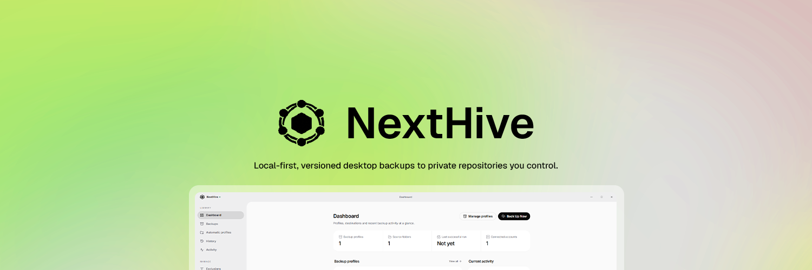
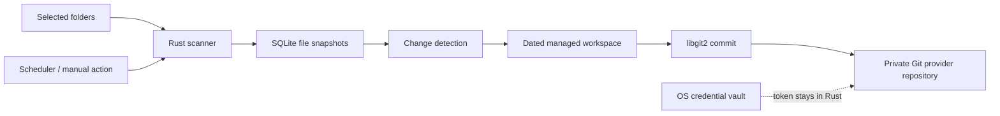
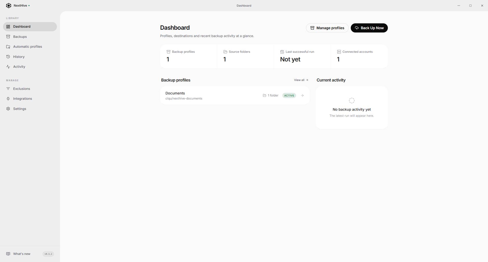

<div align="center">
  
  <h1>NextHive</h1>
  <p><strong>Local-first, versioned desktop backups to private repositories you control.</strong></p>
  <p>
    Select folders once. NextHive detects what changed, creates a dated Git snapshot,<br />
    and keeps protection running quietly from the Windows notification area.
  </p>

  <p>
    
    
    
    
    
  </p>
</div>



> [!IMPORTANT]
> NextHive is under active development. The core backup pipeline works, but restore and release hardening are not complete. Do not use it as the only copy of important data yet.

## Why NextHive?

NextHive turns Git into a private, understandable backup history without requiring Git to be installed and without placing `.git` folders inside your documents or projects.

| | |
| --- | --- |
| **Your folders stay untouched** | Scanning and Git operations happen in a managed application workspace. |
| **Only changed content is hashed** | Size and modification time provide the fast path; SHA-256 is calculated when needed. |
| **Backups are readable** | Every backup is a normal Git commit and every day is visible as a `YYYY-MM-DD` folder. |
| **Your Git provider stays yours** | Use multiple GitHub, GitLab or Gitea / Forgejo accounts and select or automatically create a private `nexthive-<profile-name>` repository. |
| **Large files fail visibly** | Files from 50–100 MiB produce a warning. GitHub profiles use the built-in LFS path at 100 MiB; other providers report the unsupported file instead of claiming success. |
| **Background protection** | Daily schedules, startup backups, missed-run catch-up, autostart and notification-area operation are built in. |

## Product highlights

- Multiple backup profiles, source folders and Git provider accounts.
- Native folder picker with canonicalization and overlapping-source protection.
- Reusable exclude profiles with glob and exact-path rules.
- Added, modified and deleted file detection backed by SQLite snapshots.
- Per-profile locking so duplicate backup jobs cannot run concurrently.
- Stage-based live progress instead of made-up percentages.
- Git commits and HTTPS pushes through embedded `libgit2`; system Git is not required.
- Private repository creation and existing repository selection across GitHub, GitLab and Gitea / Forgejo.
- Built-in Git LFS upload flow for files that exceed regular GitHub limits.
- Daily, on-startup and catch-up scheduling.
- Windows autostart, close-to-tray behavior and tray actions.
- Light, dark and system themes with a frameless desktop-native shell.
- Structured errors that keep Rust internals and credentials out of the UI.

## How a backup works



1. Acquire the profile lock and validate every source folder.
2. Scan in Rust, reusing cached size and modification metadata where possible.
3. Hash only new or potentially changed files and compare them with SQLite.
4. Materialize the selected folders' **contents** inside the current date directory.
5. Stage and commit real changes in the managed local repository.
6. Upload Git LFS objects when required, then push the Git commit.
7. Confirm the new SQLite snapshot state only after a successful push.

Failures never advance the confirmed backup state and empty commits are never created.

### Repository layout

If a profile named `Projects` protects a folder containing `src/`, `README.md` and `design/`, NextHive creates `nexthive-projects` and stores:

```text
nexthive-projects/
├── 2026-08-08/
│   ├── src/
│   ├── design/
│   └── README.md
└── 2026-08-09/
    ├── src/
    ├── design/
    └── README.md
```

The selected source folder name is not inserted as an extra directory. When multiple sources would produce the same relative path, NextHive reports the collision instead of silently overwriting either file.

## Desktop experience



NextHive can launch with Windows, remain in the notification area after the window closes and continue running scheduled or catch-up backups. Its custom window chrome supports native dragging, minimize, maximize and close behavior.

## Security model

NextHive treats backup credentials and local files as security-sensitive data.

- Provider tokens are validated in Rust and saved through the operating-system credential vault.
- Tokens are never stored in SQLite, local storage, config files or React state.
- The React frontend does not receive global filesystem access or credential values.
- Source paths are validated and canonicalized; symlink traversal is disabled while scanning.
- Git operations use typed `libgit2` APIs rather than shell command construction.
- New repositories are private by default.
- Commit metadata uses profile-level information, not sensitive absolute source paths.
- User-facing errors are sanitized while technical details stay in rotating local logs.

> [!NOTE]
> A private Git repository is access-controlled, not end-to-end encrypted storage. Managed workspace files also inherit the security of the local operating-system account and disk. Application-level backup encryption is not implemented yet.

## Anonymous usage ping

To know roughly how many devices run NextHive, the app sends one anonymous ping per day while it is running: `{"v": "<app version>", "os": "<os name>"}` to `https://nexthive.app/api/ping`. Nothing else is sent — no identifier, no hardware details, no file information — and the server stores only per-day totals (the endpoint and counter are in this repository under `apps/web`). The switch lives in **Settings → Privacy → Anonymous usage ping** and turning it off stops the ping entirely.

## Architecture

NextHive is organized as a two-application repository. The desktop product and marketing website have isolated dependencies and build outputs, while release tooling and product documentation stay at the root.

```text
apps/
├── desktop/                # shipped Tauri desktop application
│   ├── src/                # React UI, features, stores and typed IPC
│   └── src-tauri/src/      # Rust backup engine and Tauri commands
└── web/                    # Next.js marketing and download website

scripts/                    # desktop-only signed release tooling
docs/                       # shared product screenshots and assets
```

Desktop business logic lives in Rust; React is responsible for presentation, navigation and lightweight UI state. The website is independently installable and is never bundled into desktop installers.

### Technology

| Layer | Stack |
| --- | --- |
| Desktop | Tauri v2, Rust, Tokio |
| Frontend | React 18, TypeScript, Vite, Tailwind CSS, shadcn/ui, Lucide |
| State and routing | Zustand, React Router |
| Persistence | SQLite through bundled `rusqlite`, versioned migrations |
| Backup engine | SHA-256, `walkdir`, `globset`, `git2` / vendored libgit2 |
| Git providers | GitHub, GitLab and Gitea / Forgejo REST APIs through `reqwest`; Git HTTPS; GitHub LFS |
| Credentials | `keyring` with native Windows, macOS and Linux backends |

## Development setup

### Prerequisites

- Node.js 20 or newer.
- Rust stable through `rustup`.
- On Windows: Microsoft C++ Build Tools and Microsoft Edge WebView2. See the official [Tauri v2 prerequisites](https://v2.tauri.app/start/prerequisites/).

### Run locally

```bash
npm --prefix apps/desktop install
npm run desktop:dev

bun install --cwd apps/web
npm run web:dev
```

### Verify

```bash
npm run desktop:frontend:build
npm run desktop:test
npm run web:build
```

### Create a desktop build

```bash
npm run desktop:build
```

## Releases and automatic updates

NextHive checks the latest stable GitHub Release at startup and also provides a manual check under **Settings → Software updates**. Update checks, downloads and installation run through Rust; every installer is verified against the updater public key embedded in the application before it can run.

The updater private key never leaves the release computer and is never stored in GitHub Actions. Repository workflows validate the desktop and website independently without publishing a release. Keep the local key backed up securely: replacing or losing it prevents existing installations from accepting future updates.

To publish a version, move the relevant entries in [CHANGELOG.md](CHANGELOG.md) from **Unreleased** into a dated version section and update the version in `apps/desktop/package.json`, `apps/desktop/package-lock.json`, `apps/desktop/src-tauri/Cargo.toml` and `apps/desktop/src-tauri/tauri.conf.json`. Commit and push those changes, then run:

```powershell
.\scripts\release.ps1 -Version 0.1.0
```

The local release script verifies the clean `main` branch, matching desktop versions and signing key; runs only the desktop frontend and Rust tests; creates the signed NSIS installer and `latest.json`; and uploads only desktop artifacts to a stable GitHub Release. `apps/web` is never included in the installer or updater manifest. The script obtains GitHub authorization from the operating system's Git Credential Manager without printing or persisting the token. Use `-SkipBuild` only when the matching installer and signature were already produced and verified locally.

Updater signatures protect the update channel and are separate from Windows Authenticode code signing. Until an Authenticode certificate is configured, SmartScreen may still show an unknown-publisher warning for a manually downloaded installer.

## Integrations

Open **Integrations** and connect one or more GitHub, GitLab or Gitea / Forgejo accounts. GitLab supports both GitLab.com and self-managed servers; the Gitea integration also works with Forgejo and Codeberg. Tokens are validated before they enter the OS credential vault and are never returned to React.

- GitHub classic tokens need the `repo` scope; fine-grained tokens need repository contents and administration access.
- GitLab personal access tokens need the `api` scope.
- Gitea / Forgejo tokens need user read and repository write access.

When creating or editing a backup profile, choose the provider account and either select an existing repository or let NextHive create a private `nexthive-<profile-name>` repository. Dedicated SSH key generation and connection testing remain available for GitHub, but the complete backup push flow currently uses token-based HTTPS accounts.

The integration catalog also includes dedicated detail pages for Google Drive, Yandex Disk, MEGA and SFTP / FTPS. These cloud and remote-storage destinations are intentionally marked **Coming next**: NextHive will not claim a connection or successful backup until each adapter has complete authentication, transfer verification, retry handling and secure credential storage. Plain FTP will remain disabled by default because it does not protect credentials or backup data in transit.

## Local application data

On Windows, NextHive keeps data in standard per-user application directories:

```text
%APPDATA%\com.nexthive.app\
├── nexthive.db
└── repositories\<profile-id>\

%LOCALAPPDATA%\com.nexthive.app\logs\
```

Original source folders are never converted into Git repositories.

## Project status and roadmap

### Available now

- Profile, source-folder and exclude-profile management.
- Multiple GitHub, GitLab and Gitea / Forgejo identities and repository selection.
- Incremental scanning, dated snapshots, Git commits and PAT-based pushes.
- Built-in Git LFS path and actionable problem-file exclusion.
- Manual, daily, startup and catch-up backup execution.
- Run history, live activity, autostart, tray operation and themes.
- Signed automatic update checks, download progress and GitHub Release publishing.

### Next

- Google Drive OAuth and resumable-upload destination adapter.
- Yandex Disk OAuth and upload destination adapter.
- MEGA destination through the official client SDK.
- SFTP / FTPS remote-server destination with host/certificate verification.
- File-level backup detail and browsing.
- Safe file/folder restore with copy, overwrite and cancel choices.
- Complete SSH backup transport.
- Conflict reconciliation UX for repositories changed outside NextHive.
- Authenticode-signed Windows installers.
- macOS and Linux validation.

## Development principles

- Keep filesystem, hashing, database, scheduling and Git logic in Rust.
- Keep Tauri commands thin and typed.
- Never expose credentials through commands, events or frontend state.
- Add schema changes as migrations; never rebuild the database on startup.
- Prefer complete vertical slices over hidden placeholder success states.
- Never silently skip a file and report a successful backup.

---

<div align="center">
  <strong>NextHive</strong><br />
  Quiet, inspectable backups under your control.
</div>
