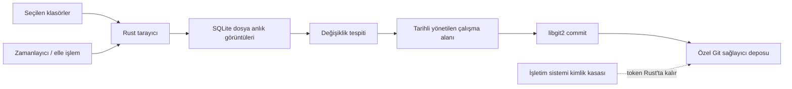

<div align="center">
  
  <h1>NextHive</h1>
  <p><strong>Yerel öncelikli, sürümlü masaüstü yedekleri — kontrolünüzdeki özel depolara.</strong></p>
  <p>
    Klasörleri bir kez seçin. NextHive neyin değiştiğini tespit eder, tarihli bir Git anlık görüntüsü oluşturur<br />
    ve korumayı Windows bildirim alanından sessizce sürdürür.
  </p>

  <p>
    
    
    
    
    
  </p>

  <p><strong>Türkçe</strong> · <a href="README.md">English</a></p>
</div>


> [!IMPORTANT]
> NextHive aktif geliştirme aşamasındadır. Temel yedekleme hattı çalışıyor, ancak geri yükleme ve sürüm sağlamlaştırma henüz tamamlanmadı. Önemli verilerinizin tek kopyası olarak kullanmayın.

## Neden NextHive?

NextHive, Git'i özel ve anlaşılır bir yedek geçmişine dönüştürür; bunu yaparken Git kurulumu gerektirmez ve belgelerinizin ya da projelerinizin içine `.git` klasörleri yerleştirmez.

| | |
| --- | --- |
| **Klasörlerinize dokunulmaz** | Tarama ve Git işlemleri, yönetilen bir uygulama çalışma alanında gerçekleşir. |
| **Yalnızca değişen içerik hash'lenir** | Boyut ve değiştirilme zamanı hızlı yolu sağlar; SHA-256 yalnızca gerektiğinde hesaplanır. |
| **Yedekler okunabilirdir** | Her yedek normal bir Git commit'idir ve her gün `YYYY-AA-GG` klasörü olarak görünür. |
| **Git sağlayıcınız sizin kalır** | Birden çok GitHub, GitLab veya Gitea / Forgejo hesabı kullanın; var olan bir depoyu seçin ya da otomatik olarak özel bir `nexthive-<profil-adı>` deposu oluşturun. |
| **Büyük dosyalar görünür şekilde başarısız olur** | 50–100 MiB aralığındaki dosyalar uyarı üretir. GitHub profilleri 100 MiB'de yerleşik LFS yolunu kullanır; diğer sağlayıcılarda başarı iddia etmek yerine desteklenmeyen dosya raporlanır. |
| **Arka planda koruma** | Günlük zamanlamalar, açılışta yedekleme, kaçan çalışmaların telafisi, otomatik başlatma ve bildirim alanında çalışma yerleşiktir. |

## Ürün öne çıkanları

- Birden çok yedekleme profili, kaynak klasör ve Git sağlayıcı hesabı.
- Yol normalleştirme ve iç içe kaynak koruması olan yerel klasör seçici.
- Glob ve tam yol kuralları içeren yeniden kullanılabilir hariç tutma profilleri.
- SQLite anlık görüntülerine dayanan eklenen, değiştirilen ve silinen dosya tespiti.
- Aynı profil için eşzamanlı yedekleme işlerini engelleyen profil bazlı kilit.
- Uydurma yüzdeler yerine aşama tabanlı canlı ilerleme.
- Gömülü `libgit2` ile Git commit'leri ve HTTPS gönderimleri; sistemde Git gerekmez.
- GitHub, GitLab ve Gitea / Forgejo üzerinde özel depo oluşturma ve var olan depoyu seçme.
- Normal GitHub sınırlarını aşan dosyalar için yerleşik Git LFS yükleme akışı.
- Günlük, açılışta ve telafili zamanlama.
- Windows otomatik başlatma, kapatınca tepsiye inme ve tepsi eylemleri.
- Açık, koyu ve sistem temaları; çerçevesiz, masaüstüne özgü bir kabuk.
- Rust iç ayrıntılarını ve kimlik bilgilerini arayüzden uzak tutan yapılandırılmış hatalar.

## Bir yedek nasıl çalışır



1. Profil kilidini al ve her kaynak klasörü doğrula.
2. Rust tarafında tara; mümkün olan yerde önbelleklenmiş boyut ve değiştirilme meta verisini yeniden kullan.
3. Yalnızca yeni veya değişmiş olabilecek dosyaları hash'le ve SQLite ile karşılaştır.
4. Seçilen klasörlerin **içeriğini** güncel tarih dizininde oluştur.
5. Yönetilen yerel depoda gerçek değişiklikleri stage'le ve commit et.
6. Gerekirse Git LFS nesnelerini yükle, ardından Git commit'ini gönder.
7. Yeni SQLite anlık görüntü durumunu yalnızca başarılı bir gönderimden sonra onayla.

Başarısızlıklar onaylanmış yedek durumunu asla ilerletmez ve boş commit'ler hiçbir zaman oluşturulmaz.

### Depo düzeni

`src/`, `README.md` ve `design/` içeren bir klasörü koruyan `Projects` adlı bir profil varsa, NextHive `nexthive-projects` deposunu oluşturur ve şunları saklar:

```text
nexthive-projects/
├── 2026-08-08/
│   ├── src/
│   ├── design/
│   └── README.md
└── 2026-08-09/
    ├── src/
    ├── design/
    └── README.md
```

Seçilen kaynak klasörün adı fazladan bir dizin olarak eklenmez. Birden çok kaynak aynı göreli yolu üretecek olursa, NextHive dosyalardan birini sessizce üzerine yazmak yerine çakışmayı raporlar.

## Masaüstü deneyimi


NextHive Windows ile birlikte başlayabilir, pencere kapandıktan sonra bildirim alanında kalabilir ve zamanlanmış ya da telafi yedeklerini çalıştırmayı sürdürebilir. Özel pencere çerçevesi; yerel sürükleme, simge durumuna küçültme, ekranı kaplama ve kapatma davranışlarını destekler.

## Güvenlik modeli

NextHive, yedekleme kimlik bilgilerini ve yerel dosyaları güvenlik açısından hassas veri olarak ele alır.

- Sağlayıcı token'ları Rust tarafında doğrulanır ve işletim sisteminin kimlik kasasına kaydedilir.
- Token'lar hiçbir zaman SQLite'ta, yerel depolamada, yapılandırma dosyalarında veya React state'inde tutulmaz.
- React arayüzü ne genel dosya sistemi erişimi ne de kimlik bilgisi değerleri alır.
- Kaynak yollar doğrulanır ve normalleştirilir; tarama sırasında sembolik bağ takibi devre dışıdır.
- Git işlemleri kabuk komutu kurgulamak yerine tipli `libgit2` API'lerini kullanır.
- Yeni depolar varsayılan olarak gizlidir.
- Commit meta verisi, hassas mutlak kaynak yolları yerine profil düzeyindeki bilgileri kullanır.
- Kullanıcıya görünen hatalar sadeleştirilir; teknik ayrıntılar döngüsel yerel günlüklerde kalır.

> [!NOTE]
> Özel bir Git deposu erişim denetimlidir; uçtan uca şifreli bir depolama değildir. Yönetilen çalışma alanı dosyaları da yerel işletim sistemi hesabının ve diskin güvenliğini devralır. Uygulama düzeyinde yedek şifreleme henüz uygulanmadı.

## Anonim kullanım ping'i

Kabaca kaç cihazın NextHive çalıştırdığını bilmek için uygulama, çalışırken günde bir anonim ping gönderir: `https://nexthive.app/api/ping` adresine `{"v": "<uygulama sürümü>", "os": "<işletim sistemi adı>"}`. Başka hiçbir şey gönderilmez — kimlik yok, donanım ayrıntısı yok, dosya bilgisi yok — ve sunucu yalnızca günlük toplamları saklar (uç nokta ve sayaç bu depoda `apps/web` altındadır). Anahtar **Ayarlar → Gizlilik → Anonim kullanım ping'i** altındadır ve kapatmak ping'i tamamen durdurur.

## Mimari

NextHive iki uygulamalı bir depo olarak düzenlenmiştir. Masaüstü ürünü ile tanıtım sitesinin bağımlılıkları ve derleme çıktıları birbirinden yalıtılmıştır; sürüm araçları ve ürün dokümantasyonu kökte durur.

```text
apps/
├── desktop/                # yayınlanan Tauri masaüstü uygulaması
│   ├── src/                # React arayüzü, özellikler, store'lar ve tipli IPC
│   └── src-tauri/src/      # Rust yedekleme motoru ve Tauri komutları
└── web/                    # Next.js tanıtım ve indirme sitesi

scripts/                    # yalnızca masaüstüne ait imzalı sürüm araçları
docs/                       # ortak ürün ekran görüntüleri ve varlıklar
```

Masaüstü iş mantığı Rust'ta yaşar; React sunum, gezinme ve hafif arayüz durumundan sorumludur. Site bağımsız olarak kurulabilir ve masaüstü kurulum dosyalarına hiçbir zaman dahil edilmez.

### Teknoloji

| Katman | Yığın |
| --- | --- |
| Masaüstü | Tauri v2, Rust, Tokio |
| Arayüz | React 18, TypeScript, Vite, Tailwind CSS, shadcn/ui, Lucide |
| Durum ve yönlendirme | Zustand, React Router |
| Kalıcılık | Paketlenmiş `rusqlite` ile SQLite, sürümlenmiş migration'lar |
| Yedekleme motoru | SHA-256, `walkdir`, `globset`, `git2` / vendored libgit2 |
| Git sağlayıcıları | `reqwest` üzerinden GitHub, GitLab ve Gitea / Forgejo REST API'leri; Git HTTPS; GitHub LFS |
| Kimlik bilgileri | Windows, macOS ve Linux yerel arka uçlarıyla `keyring` |

## Geliştirme kurulumu

### Ön koşullar

- Node.js 20 veya üzeri.
- `rustup` üzerinden Rust stable.
- Windows'ta: Microsoft C++ Build Tools ve Microsoft Edge WebView2. Resmî [Tauri v2 ön koşullarına](https://v2.tauri.app/start/prerequisites/) bakın.

### Yerelde çalıştırma

```bash
npm --prefix apps/desktop install
npm run desktop:dev

bun install --cwd apps/web
npm run web:dev
```

### Doğrulama

```bash
npm run desktop:frontend:build
npm run desktop:test
npm run web:build
```

### Masaüstü derlemesi oluşturma

```bash
npm run desktop:build
```

## Sürümler ve otomatik güncellemeler

NextHive açılışta en son kararlı GitHub Release'ini denetler; ayrıca **Ayarlar → Yazılım güncellemeleri** altında elle denetim sunar. Güncelleme denetimleri, indirmeler ve kurulum Rust üzerinden yürür; her kurulum dosyası, çalıştırılabilmeden önce uygulamaya gömülü güncelleyici genel anahtarına karşı doğrulanır.

Güncelleyici özel anahtarı sürüm bilgisayarından hiç çıkmaz ve GitHub Actions içinde saklanmaz. Depo iş akışları, bir sürüm yayımlamadan masaüstünü ve siteyi bağımsız olarak doğrular. Yerel anahtarı güvenli biçimde yedekleyin: anahtarı kaybetmek veya değiştirmek, mevcut kurulumların gelecekteki güncellemeleri kabul etmesini engeller.

Bir sürüm yayımlamak için [CHANGELOG.md](CHANGELOG.md) dosyasındaki ilgili maddeleri **Unreleased** bölümünden tarihli bir sürüm bölümüne taşıyın ve sürümü `apps/desktop/package.json`, `apps/desktop/package-lock.json`, `apps/desktop/src-tauri/Cargo.toml` ve `apps/desktop/src-tauri/tauri.conf.json` dosyalarında güncelleyin. Bu değişiklikleri commit'leyip gönderin, ardından çalıştırın:

```powershell
.\scripts\release.ps1 -Version 0.1.0
```

Yerel sürüm betiği; temiz `main` dalını, eşleşen masaüstü sürümlerini ve imzalama anahtarını doğrular; yalnızca masaüstü arayüz ve Rust testlerini çalıştırır; imzalı NSIS kurulum dosyasını ve `latest.json` dosyasını oluşturur; kararlı bir GitHub Release'ine yalnızca masaüstü çıktılarını yükler. `apps/web` hiçbir zaman kurulum dosyasına veya güncelleyici manifestosuna dahil edilmez. Betik, GitHub yetkilendirmesini işletim sisteminin Git Credential Manager'ından alır; token'ı ne yazdırır ne de kalıcılaştırır. `-SkipBuild` seçeneğini yalnızca eşleşen kurulum dosyası ve imza daha önce yerelde üretilip doğrulandığında kullanın.

Güncelleyici imzaları güncelleme kanalını korur ve Windows Authenticode kod imzalamadan ayrıdır. Bir Authenticode sertifikası yapılandırılana dek SmartScreen, elle indirilen bir kurulum dosyası için bilinmeyen yayımcı uyarısı gösterebilir.

## Entegrasyonlar

**Entegrasyonlar**'ı açın ve bir veya daha fazla GitHub, GitLab ya da Gitea / Forgejo hesabı bağlayın. GitLab hem GitLab.com'u hem de kendi sunucunuzda barındırdığınız kurulumları destekler; Gitea entegrasyonu Forgejo ve Codeberg ile de çalışır. Token'lar işletim sistemi kimlik kasasına girmeden önce doğrulanır ve React'e hiçbir zaman geri döndürülmez.

- GitHub klasik token'ları `repo` kapsamına ihtiyaç duyar; ayrıntılı (fine-grained) token'lar depo içeriği ve yönetim erişimi ister.
- GitLab kişisel erişim token'ları `api` kapsamına ihtiyaç duyar.
- Gitea / Forgejo token'ları kullanıcı okuma ve depo yazma erişimi ister.

Bir yedekleme profili oluştururken veya düzenlerken sağlayıcı hesabını seçin; ardından var olan bir depoyu seçin ya da NextHive'ın özel bir `nexthive-<profil-adı>` deposu oluşturmasına izin verin. GitHub için özel SSH anahtarı üretimi ve bağlantı testi kullanılabilir durumda kalır, ancak yedek gönderme akışının tamamı şu an token tabanlı HTTPS hesaplarını kullanır.

Entegrasyon kataloğu ayrıca Google Drive, Yandex Disk, MEGA ve SFTP / FTPS için ayrı detay sayfaları içerir. Bu bulut ve uzak depolama hedefleri bilinçli olarak **Sırada** işaretlidir: her bağdaştırıcı tam kimlik doğrulama, aktarım doğrulama, yeniden deneme yönetimi ve güvenli kimlik bilgisi saklama kazanmadan NextHive bağlantı ya da başarılı yedek iddiasında bulunmaz. Düz FTP, kimlik bilgilerini ve yedek verisini aktarım sırasında korumadığı için varsayılan olarak devre dışı kalacaktır.

## Yerel uygulama verileri

Windows'ta NextHive, verilerini standart kullanıcı başına uygulama dizinlerinde tutar:

```text
%APPDATA%\com.nexthive.app\
├── nexthive.db
└── repositories\<profil-id>\

%LOCALAPPDATA%\com.nexthive.app\logs\
```

Orijinal kaynak klasörler hiçbir zaman Git deposuna dönüştürülmez.

## Proje durumu ve yol haritası

### Şu an mevcut

- Profil, kaynak klasör ve hariç tutma profili yönetimi.
- Birden çok GitHub, GitLab ve Gitea / Forgejo kimliği ve depo seçimi.
- Artımlı tarama, tarihli anlık görüntüler, Git commit'leri ve PAT tabanlı gönderimler.
- Yerleşik Git LFS yolu ve harekete geçirilebilir sorunlu dosya hariç tutma.
- Elle, günlük, açılışta ve telafili yedek çalıştırma.
- Çalışma geçmişi, canlı etkinlik, otomatik başlatma, tepsi kullanımı ve temalar.
- İmzalı otomatik güncelleme denetimleri, indirme ilerlemesi ve GitHub Release yayımlama.

### Sırada

- Google Drive OAuth ve sürdürülebilir yükleme hedef bağdaştırıcısı.
- Yandex Disk OAuth ve yükleme hedef bağdaştırıcısı.
- Resmî istemci SDK'sı üzerinden MEGA hedefi.
- Sunucu/sertifika doğrulamalı SFTP / FTPS uzak sunucu hedefi.
- Dosya düzeyinde yedek ayrıntısı ve gezinme.
- Kopyalama, üzerine yazma ve iptal seçenekleriyle güvenli dosya/klasör geri yükleme.
- Eksiksiz SSH yedek aktarımı.
- NextHive dışında değiştirilen depolar için çakışma çözüm deneyimi.
- Authenticode ile imzalanmış Windows kurulum dosyaları.
- macOS ve Linux doğrulaması.

## Geliştirme ilkeleri

- Dosya sistemi, hash'leme, veritabanı, zamanlama ve Git mantığını Rust'ta tutun.
- Tauri komutlarını ince ve tipli tutun.
- Kimlik bilgilerini komutlar, olaylar veya arayüz durumu üzerinden hiçbir zaman açığa çıkarmayın.
- Şema değişikliklerini migration olarak ekleyin; veritabanını açılışta asla yeniden oluşturmayın.
- Gizli yer tutucu başarı durumları yerine eksiksiz dikey dilimleri tercih edin.
- Bir dosyayı sessizce atlayıp yedeği başarılı olarak raporlamayın.

---

<div align="center">
  <strong>NextHive</strong><br />
  Sessiz, denetlenebilir ve kontrolü sizde olan yedekler.
</div>
